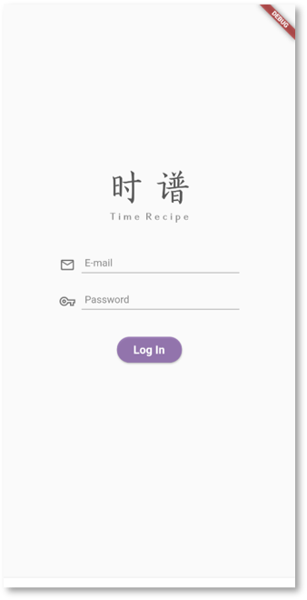
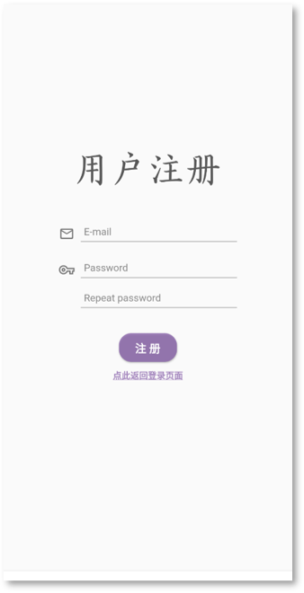

# Time Recipe

A cross-platform (Web, Android, iOS) timeline scheduler.  

## Task View

    
      
    

    
    
    
    

## Statistics View

    
    

## User Authentication
User login and user registraion.  

    
    

